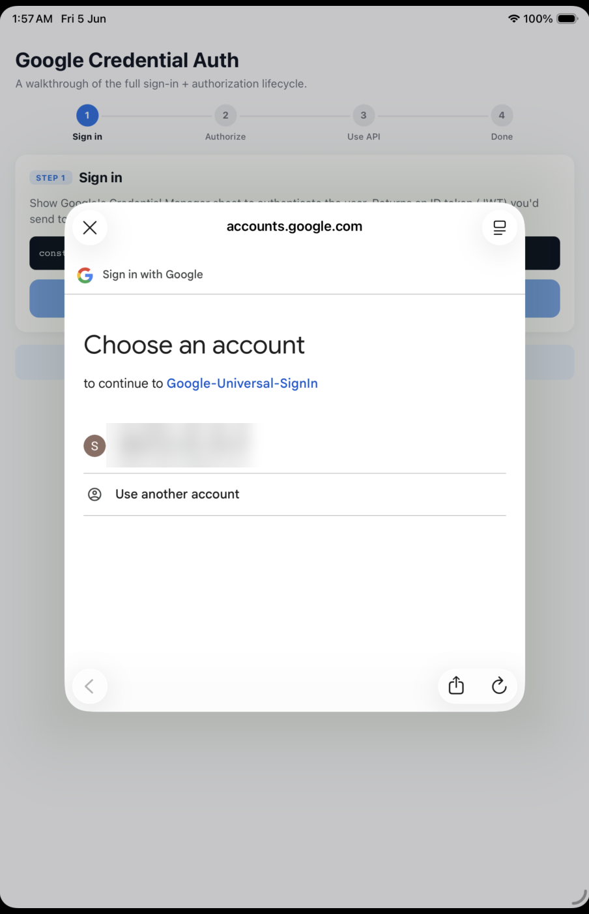
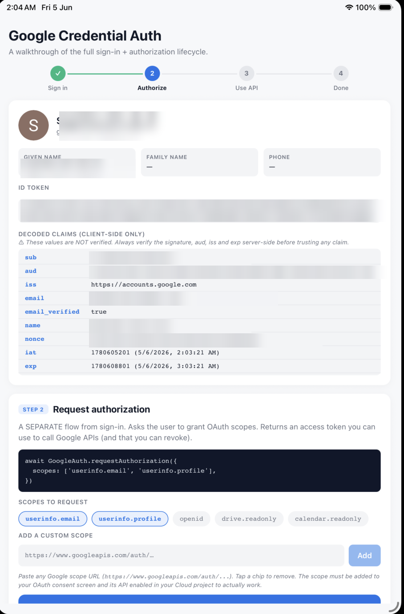

# expo-google-credential-auth

Modern **Sign in with Google** and **OAuth authorization** for Expo / React Native.

- **Sign in** — get a verified Google ID token via a silent one-tap (returning users) or full account picker (first-time users).
- **Authorize** — request OAuth scopes and get an access token to call any Google API (Drive, Calendar, Gmail, People, etc.).
- **Revoke** — properly disconnect a user from Google's side AND clear stubborn local OAuth caches.

> **Android + iOS.** On Android it's built on [Credential Manager](https://developer.android.com/identity/sign-in/credential-manager-siwg) + Google Identity Services (the modern APIs Google recommends for all new apps). On iOS it wraps the official [GoogleSignIn SDK](https://developers.google.com/identity/sign-in/ios), exposing the same JS API. Web is still on the roadmap — open an issue or PR if you need it.

## Demo

The **native OS account picker** — no browser, no WebView. Tap **Sign in with Google**, the system credential sheet slides up, and you get back a verified ID token with decoded claims:

<table>
  <tr>
    <td align="center"></td>
    <td align="center"></td>
  </tr>
  <tr>
    <td align="center"><sub>Native Google account sheet</sub></td>
    <td align="center"><sub>ID token + decoded claims</sub></td>
  </tr>
</table>

## Why this exists

The popular [`@react-native-google-signin/google-signin`](https://www.npmjs.com/package/@react-native-google-signin/google-signin) free package still wraps the **legacy Google Sign-In SDK** on Android. Google has deprecated that SDK in favor of Credential Manager + Identity Services, which is what this package uses.

The paid Universal Sign-In version uses these modern APIs too — this package gives you the same modern Android flow as a small, focused, open-source alternative.

## Install

```sh
npm install expo-google-credential-auth
# or
yarn add expo-google-credential-auth
```

You'll need a [development build](https://docs.expo.dev/develop/development-builds/introduction/) — this module requires native code, so it cannot run in Expo Go.

```sh
npx expo prebuild
npx expo run:android
# or
npx expo run:ios
```

## Setup (Google Cloud Console)

You need OAuth client IDs in the same Google Cloud project: a **Web** client (always), plus an **Android** client (for Android) and/or an **iOS** client (for iOS).

### 1. Android OAuth client

Identifies your app to Google. You don't reference it in code, but it must exist.

- Type: **Android**
- Package name: your app's `android.package` from `app.json`
- SHA-1 fingerprint: see below

Get your debug SHA-1:

```sh
cd android
./gradlew signingReport
```

Look for the `debug` variant's `SHA1` line. For production, you'll also need to add your **release** SHA-1 (and, if using Play App Signing, the Play Signing SHA-1 from Play Console).

### 2. Web OAuth client

This is the one you pass to `configure()` — counterintuitive, but Google uses the Web client as the "audience" of the ID token even on native.

- Type: **Web application**
- No redirect URIs needed

Copy the resulting client ID (ends in `.apps.googleusercontent.com`) — you'll pass it as `webClientId`.

### 2b. iOS OAuth client (iOS only)

Identifies your app to Google on iOS. Unlike Android, you **do** reference it in code (as `iosClientId`).

- Type: **iOS**
- Bundle ID: your app's `ios.bundleIdentifier` from `app.json`

Copy the resulting client ID — you'll pass it as `iosClientId`. You also need to register its **reversed** form as a URL scheme so Google can hand the OAuth result back to your app.

**The easy way — use the bundled config plugin** (recommended). Add it to your `app.json` / `app.config.js` and it injects the URL scheme (and `GIDClientID`) into Info.plist on every `prebuild`, so you never touch native files:

```json
{
  "expo": {
    "plugins": [
      ["expo-google-credential-auth", { "iosClientId": "123-abc.apps.googleusercontent.com" }]
    ]
  }
}
```

Then `npx expo prebuild` and you're done. (Android needs no native config, so the plugin is iOS-only.)

<details>
<summary>Manual alternative (bare workflow / no prebuild)</summary>

Add this to `ios/<yourapp>/Info.plist` under `CFBundleURLTypes`:

```xml
<key>CFBundleURLTypes</key>
<array>
  <dict>
    <key>CFBundleURLSchemes</key>
    <array>
      <!-- Your iOS client's REVERSED client ID -->
      <string>com.googleusercontent.apps.123456789-abcdef</string>
    </array>
  </dict>
</array>
```

The reversed client ID is just your iOS client ID with the dot-separated segments reversed: `123-abc.apps.googleusercontent.com` → `com.googleusercontent.apps.123-abc`.
</details>

### 3. OAuth consent screen

Required even for testing. Go to **APIs & Services → OAuth consent screen**:

1. **User type**: External (or Internal if you're in a Workspace org and only testing internally).
2. Fill in the app name, support email, dev email.
3. **Scopes**: click **Add or Remove Scopes** and add every scope your app will request. At minimum:
   - `openid`
   - `.../auth/userinfo.email`
   - `.../auth/userinfo.profile`
   - …plus any API scopes (e.g. `.../auth/drive.readonly`) you'll call `requestAuthorization` with.
4. **Test users**: while the app is in "Testing" mode, add every Google account email that will sign in.
5. Save and continue through every page (changes don't persist if you bail midway).

### 4. Enable any APIs you'll call

For each Google API you'll use (Drive, Calendar, Gmail, etc.), enable it in **APIs & Services → Library**. The basic identity APIs (`/userinfo`) are always available, no extra setup.

## Quick start

```ts
import GoogleAuth from 'expo-google-credential-auth';

// Call once at app startup.
GoogleAuth.configure({
  webClientId: 'XXXX.apps.googleusercontent.com',
  iosClientId: 'YYYY.apps.googleusercontent.com', // required on iOS, ignored on Android
});

// 1. Authenticate the user. Returns an ID token your backend can verify.
const r = await GoogleAuth.signIn({ nonce: 'fresh-random-per-attempt' });
if (r.type !== 'success') return;
const idToken = r.idToken;

// 2. Authorize specific OAuth scopes. Returns an access token for HTTP API calls.
const auth = await GoogleAuth.requestAuthorization({
  scopes: [
    'https://www.googleapis.com/auth/userinfo.email',
    'https://www.googleapis.com/auth/userinfo.profile',
    // any other scope you want — see "Scopes" section below
  ],
});

// 3. Use the access token to call any Google API the user granted scopes for.
const res = await fetch('https://www.googleapis.com/oauth2/v3/userinfo', {
  headers: { Authorization: `Bearer ${auth.accessToken}` },
});

// 4. Revoke the OAuth grant when the user disconnects.
await GoogleAuth.revokeAccess(auth.accessToken);

// 5. Sign out clears Credential Manager's auto-select hint.
await GoogleAuth.signOut();
```

## Authentication vs authorization

This module exposes them as **two separate flows** because they are two separate things:

| | `signIn` | `requestAuthorization` |
|---|---|---|
| What it proves | *Who* the user is | *What* you can do on their behalf |
| Returns | ID token (JWT) | Access token (opaque OAuth bearer) |
| Audience | Your backend (verify the JWT) | Google API endpoints |
| Revocable? | No (JWTs just expire) | Yes (`revokeAccess`) |
| UI | Bottom-sheet account picker | OAuth consent screen |

Most legacy libraries conflate them into one call. Keeping them separate matches what's actually happening underneath and gives you finer control — you can sign in without authorizing, request more scopes later, or revoke API access without signing out.

## Scopes

**You can request any OAuth scope Google supports** — this module passes your `scopes` array straight through to Android's `AuthorizationClient` without modification. Browse Google's [OAuth scopes catalog](https://developers.google.com/identity/protocols/oauth2/scopes) to find what you need.

Some examples:

```ts
// Profile + email (basic identity, almost always wanted)
['https://www.googleapis.com/auth/userinfo.email',
 'https://www.googleapis.com/auth/userinfo.profile',
 'openid']

// Read-only access to Drive files
['https://www.googleapis.com/auth/drive.readonly']

// Read user's primary calendar
['https://www.googleapis.com/auth/calendar.readonly']

// Send mail as the user
['https://www.googleapis.com/auth/gmail.send']

// Multiple at once — one consent prompt covers them all
['https://www.googleapis.com/auth/userinfo.email',
 'https://www.googleapis.com/auth/drive.readonly',
 'https://www.googleapis.com/auth/calendar.readonly']
```

Three requirements for a scope to actually work:

1. **The scope must be added to your OAuth Consent Screen** (Cloud Console → OAuth consent screen → Scopes).
2. **The corresponding API must be enabled** in your project (Cloud Console → APIs & Services → Library).
3. **For sensitive / restricted scopes** (Drive, Gmail, etc.), Google requires verification before you can go to production. In Testing mode it works for listed test users.

### One important gotcha: identity-only scope requests don't trigger the consent screen

If you request **only** identity scopes (`openid`, `userinfo.email`, `userinfo.profile`), Android's `AuthorizationClient` treats them as "already granted via sign-in" and silently returns an identity-flavored token that **doesn't work as an OAuth bearer** for HTTP APIs.

To force a real OAuth grant, include at least one API scope alongside the identity scopes, even if you don't strictly need it. The resulting access token will then work for `/userinfo` and any other endpoint.

## API reference

### `configure(options)`

```ts
configure(options: { webClientId: string; iosClientId?: string }): void
```

Stores your OAuth client IDs. Call once at startup. Throws if `webClientId` is missing. `iosClientId` is required on iOS (unless you set `GIDClientID` in Info.plist) and ignored on Android.

### `signIn(options?)`

```ts
signIn(options?: { nonce?: string }): Promise<SignInResult>

type SignInResult =
  | { type: 'success'; idToken: string; user: GoogleUser }
  | { type: 'cancelled' }
  | { type: 'noSavedCredentialFound' };

type GoogleUser = {
  email: string;
  name: string | null;
  givenName: string | null;
  familyName: string | null;
  phoneNumber: string | null;
  photo: string | null;
};
```

Authenticates the user. Returns a typed discriminated union — no exception-as-control-flow for the common "cancelled" / "no account" cases. Real errors (network failure, misconfiguration) still throw.

The flow runs in two passes: a silent attempt for returning users (one-tap), falling back to a full account picker for first-time users.

The user's **stable Google ID** is in the JWT's `sub` claim — decode `idToken` server-side after verifying its signature. The `email` field on `GoogleUser` is the user's email, which is mutable; don't use it as a primary key.

### `requestAuthorization(options)`

```ts
requestAuthorization(options: {
  scopes: string[];
  offlineAccess?: boolean;
}): Promise<AuthorizationResult>

type AuthorizationResult = {
  accessToken: string | null;
  grantedScopes: string[];
  serverAuthCode: string | null;
};
```

Requests OAuth scopes. Returns an access token your client can use to call Google APIs directly.

- `scopes`: array of any scope strings — see [Scopes](#scopes).
- `offlineAccess`: if `true`, also returns a one-time `serverAuthCode` your backend can exchange (using the OAuth client *secret*) for a refresh token. Useful when your server needs to call Google APIs on the user's behalf while they're offline.

The first call for new scopes shows Google's consent screen. Returning users with previously-granted scopes get a silent grant (no UI).

### `revokeAccess(accessToken)`

```ts
revokeAccess(accessToken: string): Promise<void>
```

Tells Google to forget the OAuth grant for this token, and clears the local Android OAuth caches that would otherwise return a stale token on the next `requestAuthorization`. The user will see the consent screen again next time.

Idempotent: passing a token Google has already invalidated is a no-op, not an error.

### `signOut()`

```ts
signOut(): Promise<void>
```

Clears Credential Manager's auto-select hint for your app. The next `signIn()` will show the picker again. **This does not sign the user out of Google** — the account remains on the device, and any OAuth grants stay intact until you call `revokeAccess`.

## Platform differences

The JS API is identical across platforms, but a few behaviours differ because the underlying native SDKs do:

| | Android | iOS |
|---|---|---|
| Backing SDK | Credential Manager + Identity Services | GoogleSignIn SDK |
| `signIn({ nonce })` | nonce embedded in the ID token | nonce **ignored** (SDK has no support) |
| `signIn` → `noSavedCredentialFound` | returned when no Google account exists on device | not returned — iOS always shows the interactive flow |
| `GoogleUser.phoneNumber` | populated if available | always `null` (not exposed by the SDK) |
| `requestAuthorization` | independent Identity authorization flow | tied to the signed-in GoogleSignIn user (signs in / adds scopes as needed) |
| Extra config | none in code | `iosClientId` + reversed-client-ID URL scheme |

## What this package does *not* do

- **web / macOS** — not yet supported.
- **Backend ID token verification** — that's your server's job. Use Google's [`google-auth-library`](https://www.npmjs.com/package/google-auth-library) or any standard JWT library to verify the signature, `aud`, `iss`, `exp`, and (if you sent one) `nonce` claims.
- **Refresh token rotation** — handled by your backend when it exchanges the `serverAuthCode`.

## Troubleshooting

### `noSavedCredentialFound` on emulator

Emulators usually have no Google account. Open device Settings → Accounts → add a Google account, or test on a real device.

### Sign-in fails with a vague error code (e.g. `[16]` or `DEVELOPER_ERROR`)

Almost always a SHA-1 / package name mismatch. Verify:
- The SHA-1 in your **Android** OAuth client matches `./gradlew signingReport`
- The package name in your **Android** OAuth client matches `android.package` in your app config
- Your **Web** and **Android** OAuth clients are in the **same** Google Cloud project

For production builds, you also need to register the release SHA-1 separately (and the Play Signing SHA-1 if using Play App Signing).

### "Access blocked: the app is currently being tested"

Your Google account isn't on the OAuth Consent Screen's **Test users** list. Add it under APIs & Services → OAuth consent screen → Test users.

### `requestAuthorization` returns a token but `/userinfo` (or any Google API) returns 401 / Invalid Credentials

Two known causes:

1. **You only requested identity scopes** — see the gotcha in the [Scopes](#scopes) section. Add an API scope to force a real OAuth grant.
2. **Your local Play Services OAuth cache is stale** — common after revoking from outside the app, or after a Cloud project config change. Easiest fix: test with a different Google account, or remove + re-add the account in device Settings → Accounts.

This module's `revokeAccess` calls multiple cache-clearing APIs to keep the local state in sync, but Play Services caches can occasionally outlive even those.

### `is not a function (it is undefined)` after editing Kotlin

JS hot-reloaded but the native module wasn't rebuilt. Run `npx expo run:android` again — native code changes always require a full rebuild.

## License

MIT
